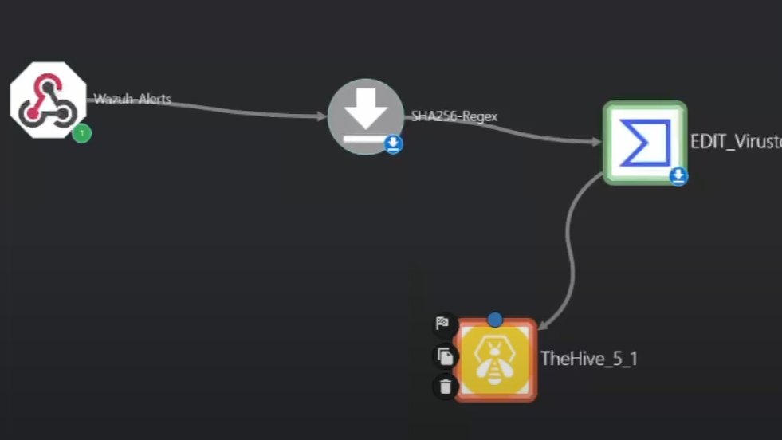
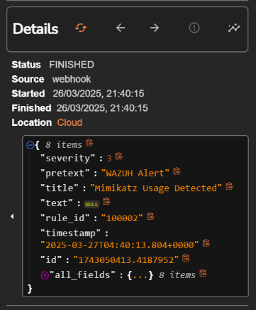
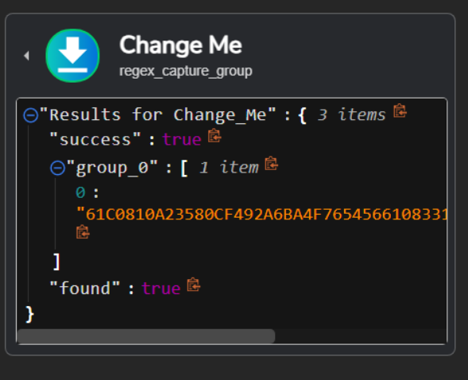
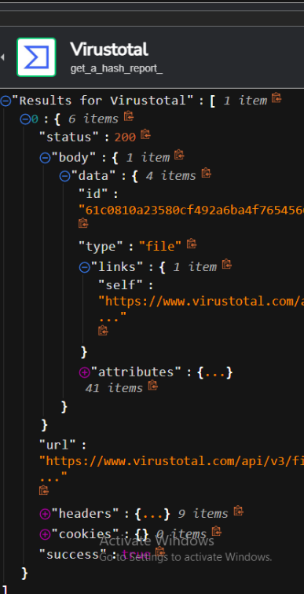
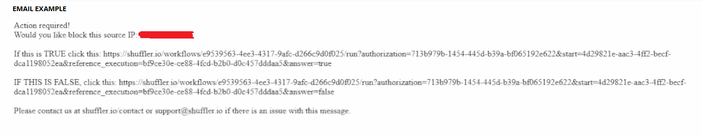

# 🛡️ SOC AUTOMATION LAB


---

## Architecture

The goal was to detect credential dumping in real time and automate escalation via email directly to SOC analysts. This includes alert triage, threat intelligence enrichment, and active blocking of malicious sources.

The detection starts at the endpoint and flows through Wazuh, Shuffle, VirusTotal, and TheHive. Each system plays a distinct role in visibility, automation, and triage.

---
## 🔧 Tools & Stack

- Shuffle (SOAR Platform)
- Wazuh (SIEM/IDS)
- Sysmon (Windows system logging)
- Mimikatz (Attack simulation)
- VirusTotal API (Threat Intel)
- TheHive (Alerting & Triage)
- DigitalOcean (Cloud infrastructure)
- SquareX (Disposable email for alert simulation)
---

## 📚 What I Learned

- How to build a fully automated blue team workflow from scratch
- Writing custom detection rules in Wazuh using regex on metadata (`originalFileName`)
- Understood attacker evasion techniques (renaming Mimikatz to `thisissupersafe.exe`)
- Parsed event logs using Sysmon + Wazuh + custom filters
- Extracted SHA256 hashes using regex in Shuffle: `SHA256=([0-9A-Fa-f]{64})`
- Integrated with VirusTotal’s API to pull hash reputation data
- Created structured alert payloads for TheHive with TLP/PAP/severity/tags
- Used SquareX to simulate SOC email alerts securely
- Practiced port forwarding/ngrok/firewall configs on DigitalOcean
- Learned how to simulate Mimikatz on a VM in a safe lab

---

## Startup Flow

Mimikatz Execution → Wazuh Alert → Shuffle Webhook Trigger →  
Regex Extraction (SHA256) → VirusTotal Reputation Check →  
Alert to TheHive → Email Analyst

## 📁 File Structure

```text
SOC-automation-LAB/
├── README.md
├── Workflow
├── artifacts/
│   ├── TheHive_Payload.txt
│   └── workflow_export.json
├── screenshots/
│   ├── wazuhdetection.png
│   ├── emailexample.png
│   ├── hashcaptured.png
│   ├── virustotalreceivedhash.png
│   └── workflow.png

```
---

## Key Components

- `local_rules.xml`: Wazuh rule to detect Mimikatz using original filename metadata
- `ossec.conf`: Configured to collect Sysmon event logs from EventChannel
- `workflow_export.json`: Shuffle automation extracting SHA256 and sending alerts
- `alert_payload.json`: Alert body for TheHive using dynamic inputs from execution
- `run_mimikatz.ps1`: PowerShell script to simulate an attack for testing

---

## Example Wazuh Rule

```xml
<rule id="100002" level="15">
  <if_group>sysmon_event1</if_group>
  <field name="win.eventdata.originalFileName" type="pcre2">(?i)mimikatz\.exe</field>
  <description>Mimikatz Usage Detected</description>
  <mitre>
    <id>T1003</id>
  </mitre>
</rule>
```

---

## Example Alert Body (TheHive)

```json
{
  "title": "Mimikatz Detected",
  "description": "Mimikatz detected on host: {{ exec.all_fields.data.win.system.computer }}",
  "summary": "PID: {{ exec.all_fields.data.win.system.processID }} | Cmd: {{ exec.all_fields.data.win.eventdata.commandLine }}",
  "severity": 2,
  "tlp": 2,
  "pap": 2,
  "tags": ["T1003", "Mimikatz"],
  "source": "Wazuh",
  "status": "New"
}
```
---

### 🖼️ Example Screenshots

md
## 🖼️ Screenshots

**🔁 Full Automation Workflow**
> 

**🛡️ Mimikatz Detection via Wazuh**
> 

**🧠 SHA256 Regex Extraction**
> 

**🌐 VirusTotal Hash Enrichment**
> 

**📧 Email Alert to Analyst**
> 
